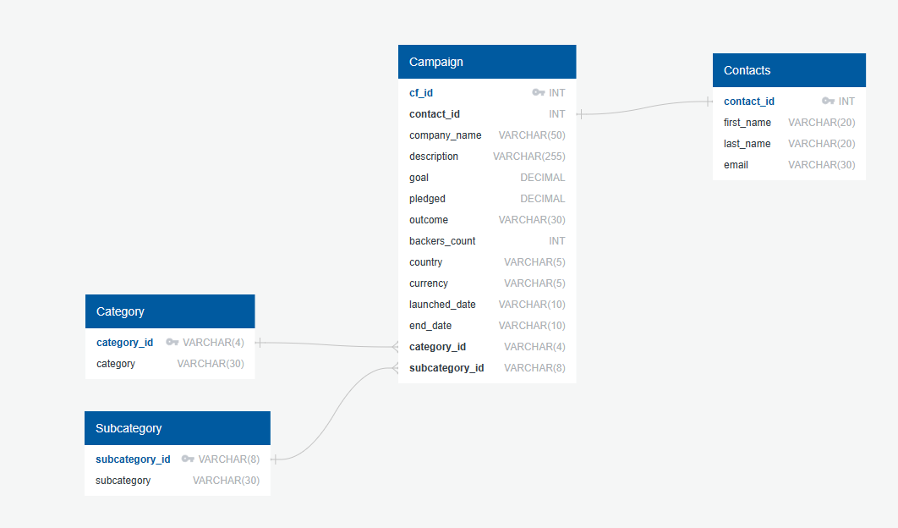
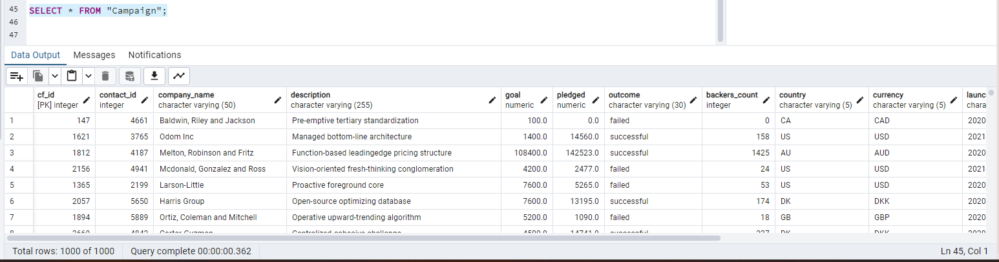
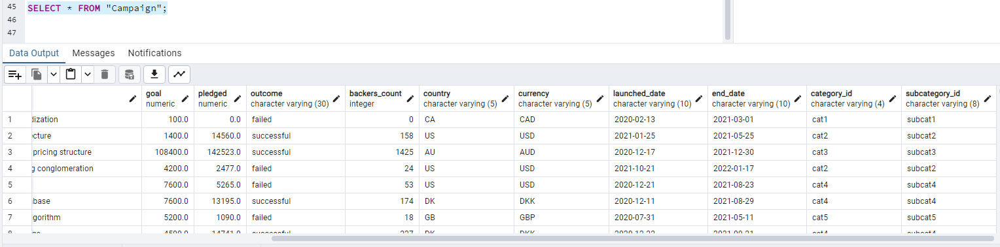
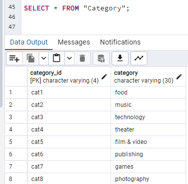
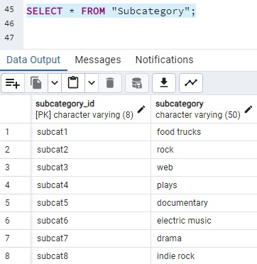
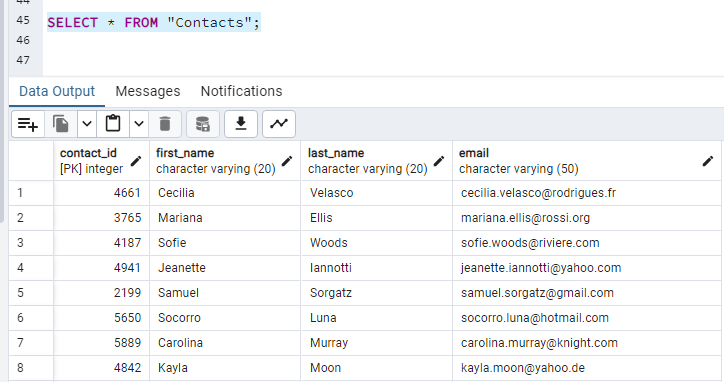

# Crowdfunding_ETL

## Introduction
For the ETL mini project, we worked to practice building an ETL pipeline using Python, Pandas, and chose to show our knowledge of both Python dictionary methods and regular expressions to extract and transform the data (contacts table). After transforming the data, four CSV files were created and the CSV file data was used to create an ERD and a table schema. Finally, we uploaded the CSV file data into a Postgres database (screenshots at the end).

### Collaborators
* Anna Bitzer
* Nora Chian

### Data Sources
Within the resource folder: 
* contacts.xlsx
* crowdfunding.xlsx

## Deliverables
Our ERD: 

The schema used to create the SQL database tables can be found in the folder "SQL Files" --> crowdfunding_db_schema.sql.

Each of our data outputs as shown in Postgres:

The remainder of the DataFrames and other results of the work outlined below can be found in the ETL_Mini_Project_NChian_ABitzer.ipynb file.

## Project Outline
### Primary Outcomes
The outcomes for this mini project are divided into four subsections and work was divided as follows:

1. Anna was responsible for: 
* Creating the Campaign DataFrame
* Creating the Crowdfunding Database

2. Nora was responsible for:
* Creating the Contacts DataFrame
* Creating the Category and Subcategory DataFrames

### Category and Subcategory DataFrames
1. Extract and transform the crowdfunding.xlsx Excel data to create a category DataFrame that has the following columns:
* A "category_id" column that has entries going sequentially from "cat1" to "catn", where n is the number of unique categories
* A "category" column that contains only the category titles

2. Export the category DataFrame as category.csv to this GitHub repository (resources folder).

3. Extract and transform the crowdfunding.xlsx Excel data to create a subcategory DataFrame that has the following columns:
* A "subcategory_id" column that has entries going sequentially from "subcat1" to "subcatn", where n is the number of unique subcategories
* A "subcategory" column that contains only the subcategory titles

4. Export the subcategory DataFrame as subcategory.csv to this GitHub repository (resources folder).

### Campaign DataFrame
1. Extract and transform the crowdfunding.xlsx Excel data to create a campaign DataFrame has the following columns:
* The "cf_id" column
* The "contact_id" column
* The "company_name" column
* The "blurb" column, renamed to "description"
* The "goal" column, converted to the float data type
* The "pledged" column, converted to the float data type
* The "outcome" column
* The "backers_count" column
* The "country" column
* The "currency" column
* The "launched_at" column, renamed to "launch_date" and with the UTC times converted to the datetime format
* The "deadline" column, renamed to "end_date" and with the UTC times converted to the datetime format
* The "category_id" column, with unique identification numbers matching those in the "category_id" column of the category DataFrame
* The "subcategory_id" column, with the unique identification numbers matching those in the "subcategory_id" column of the subcategory DataFrame

2. Export the campaign DataFrame as campaign.csv as saved within the Resources folder for this GitHub repository.

### Contacts DataFrame
There were two options for methodology around extracting and transforming the data from the contacts.xlsx Excel data:

* Option 1: Use Python dictionary methods.
* Option 2: Use regular expressions.

1. To follow Option 1, complete the following steps:
* Import the contacts.xlsx file into a DataFrame.
* Iterate through the DataFrame, converting each row to a dictionary.
* Iterate through each dictionary, doing the following:
* Extract the dictionary values from the keys by using a Python list comprehension.
* Add the values for each row to a new list.
* Create a new DataFrame that contains the extracted data.
* Split each "name" column value into a first and last name, and place each in a new column.
* Clean and export the DataFrame as contacts.csv as saved within the Resources folder for this GitHub repository.

2. To follow Option 2, complete the following steps:
* Import the contacts.xlsx file into a DataFrame.
* Extract the "contact_id", "name", and "email" columns by using regular expressions.
* Create a new DataFrame with the extracted data.
* Convert the "contact_id" column to the integer type.
* Split each "name" column value into a first and a last name, and place each in a new column.
* Clean and then export the DataFrame as contacts.csv as saved within the Resources folder for this GitHub repository.

## Creating the Crowdfunding Database
1. Inspect the four CSV files, and then sketch an ERD of the tables by using QuickDBDLinks to an external site (ours can be found under the Deliverables heading).

2. Use the information from the ERD to create a table schema for each CSV file.
* Note: Remember to specify the data types, primary keys, foreign keys, and other constraints.

3. Save the database schema as a Postgres file named crowdfunding_db_schema.sql.

4. Create a new Postgres database, named crowdfunding_db.

5. Using the database schema, create the tables in the correct order to handle the foreign keys.

6. Verify the table creation by running a SELECT statement for each table.

7. Import each CSV file into its corresponding SQL table.

8. Verify that each table has the correct data by running a SELECT statement for each (our results are shown at the top under the Deliverables heading).
